Path Tracer Part IV: Global Illumination
======================

**University of Pennsylvania, CIS 561: Advanced Computer Graphics, Homework 5**

Name: Keqi Wu
PennKey: keqiwu

Render Results

PT_cornellBox.json:

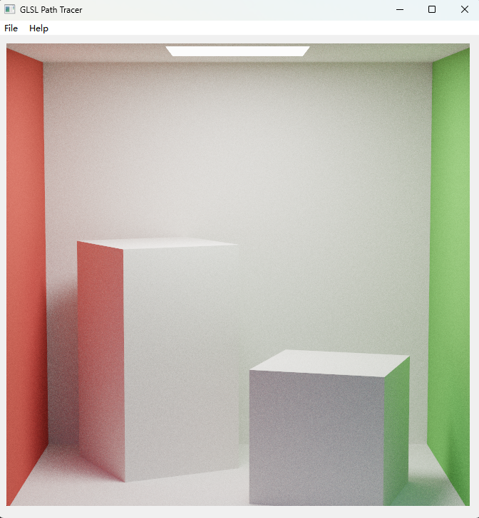

PT_cornellBoxSpotLight.json:

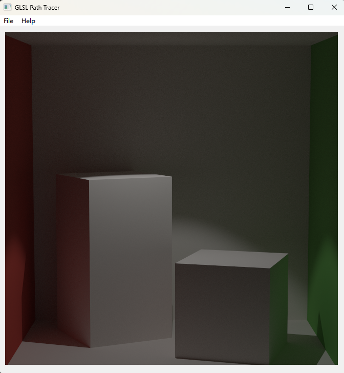

PT_cornellBoxPointLight.json:

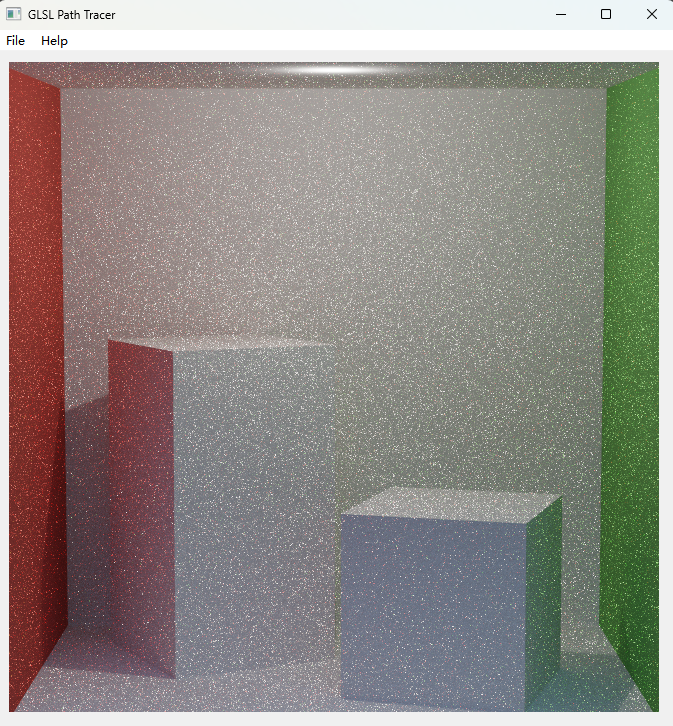

PT_roughMirrorBoxUniform.json:

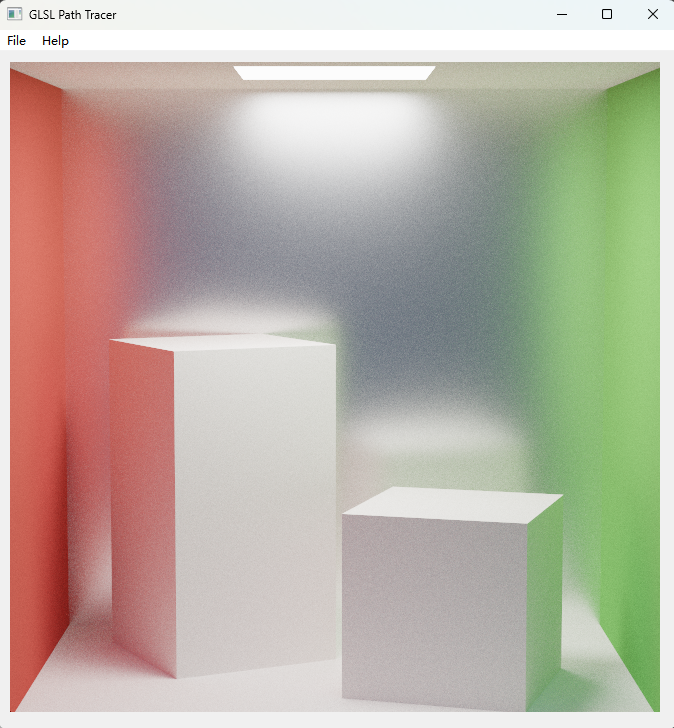

Custom scene 1:

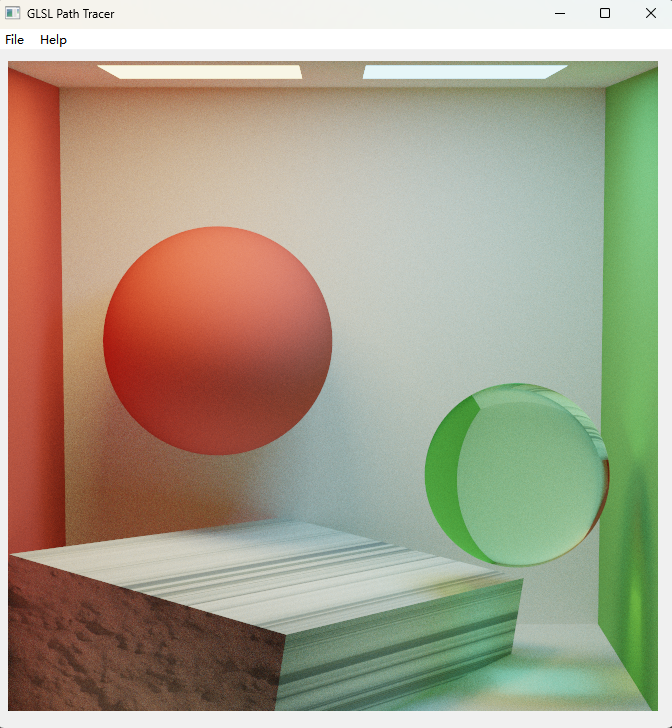

Custom scene 2:

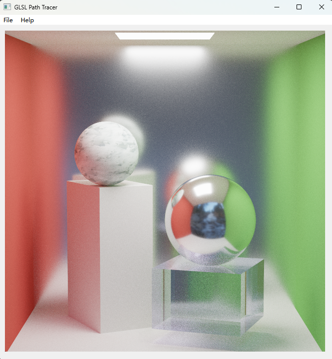

Custom scene 3:

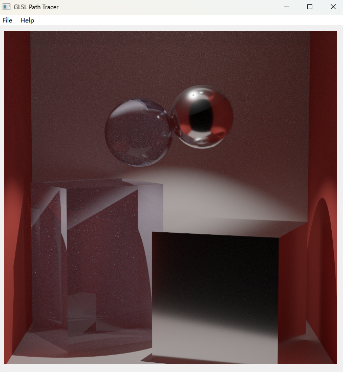

Overview
------------
You will implement a new light integrator function: `Li_Full`. This integrator
will compute both the direct lighting and global illumination at each ray intersection
to produce a more converged image in a shorter period of
time. Compare the result of using `Li_Naive` to render the
basic Cornell Box scene to the result of using the `Li_Full`:

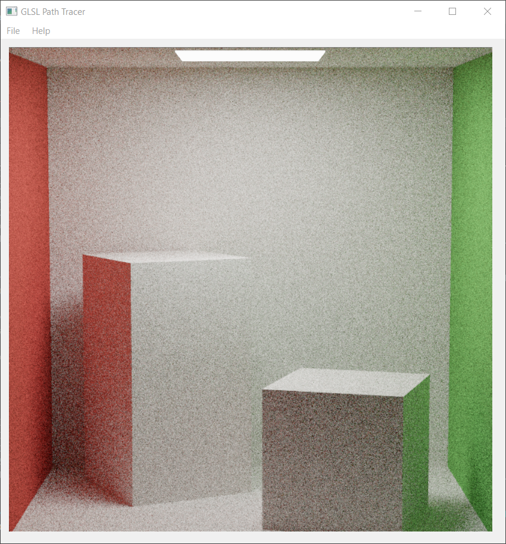 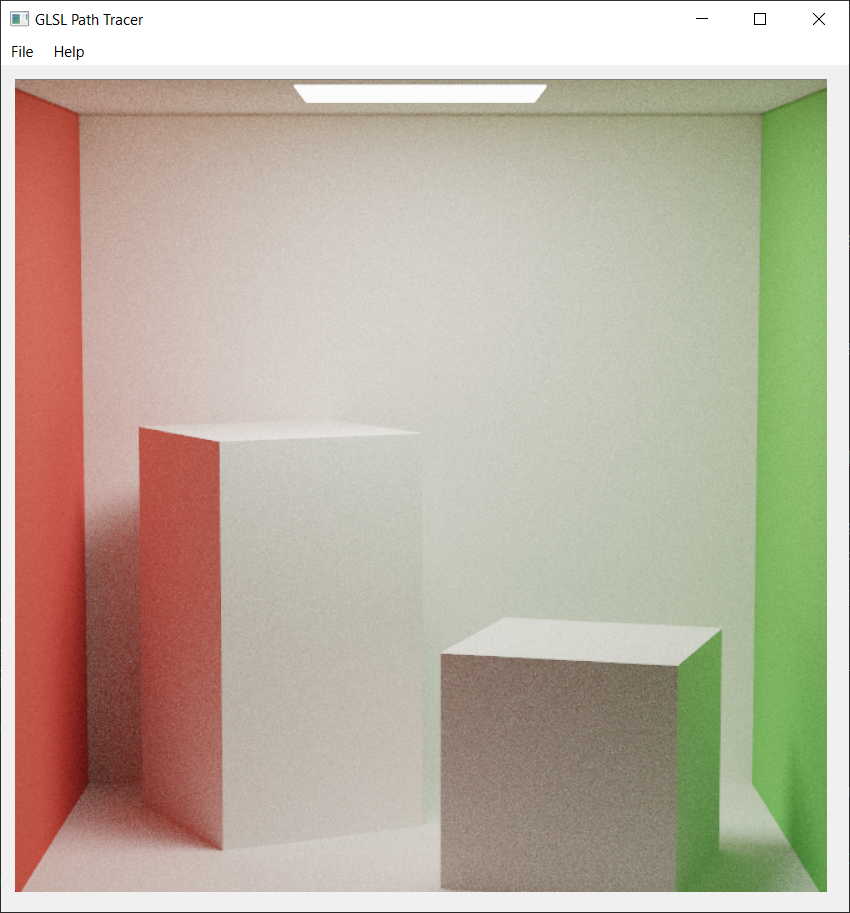

Notice how the `Li_Full` result is much less noisy and a bit brighter; this is
because each ray path is much more likely to receive light from a light source
as each intersection directly samples a light.

Useful Reading
---------
Once again, you will find the textbook will be very helpful when implementing
this homework assignment. We recommend referring to the following chapters:
* 14.5: Path Tracing

The Light Transport Equation
--------------
#### Lo(p, &#969;o) = Le(p, &#969;o) + &#8747;S f(p, &#969;o, &#969;i) Li(p, &#969;i) V(p', p) |dot(&#969;i, N)| _d_&#969;i

* __Lo__ is the light that exits point _p_ along ray &#969;o.
* __Le__ is the light inherently emitted by the surface at point _p_
along ray &#969;o.
* __&#8747;S__ is the integral over the sphere of ray
directions from which light can reach point _p_. &#969;o and
&#969;i are within this domain.
* __f__ is the Bidirectional Scattering Distribution Function of the material at
point _p_, which evaluates the proportion of energy received from
&#969;i at point _p_ that is reflected along &#969;o.
* __Li__ is the light energy that reaches point _p_ from the ray
&#969;i. This is the recursive term of the LTE.
* __V__ is a simple visibility test that determines if the surface point _p_' from
which &#969;i originates is visible to _p_. It returns 1 if there is
no obstruction, and 0 is there is something between _p_ and _p_'. This is really
only included in the LTE when one generates &#969;i by randomly
choosing a point of origin in the scene rather than generating a ray and finding
its intersection with the scene.
* The __absolute-value dot product__ term accounts for Lambert's Law of Cosines.

Updating this README (5 points)
-------------
Make sure that you fill out this `README.md` file with your name and PennKey,
along with your test renders. You should render each of the new scenes we have
provided you, once with each integrator type. At minimum we expect renders using
the default sample count and recursion depth, but you are encouraged to try
rendering scenes with more samples to get nicer looking results.

`Li_Full`'s overall code body (10 points)
--------------
As with `Li_Naive`, `Li_Full` will use a `for` loop to iteratively bounce
your ray throughout the scene. This means you will once again need a `throughput`
variable to track how your light is dampened by the surfaces off of which your
ray scatters. Additionally, you will need an `accumulated_light` variable to track
the overall color sent back to your camera, since unlike in `Li_Naive` we will be
sampling our direct illumination at every intersection.

The structure of `Li_Full` will be similar to `Li_Naive`, but as we will discuss in
the next section there are some notable alterations and optimizations.

Computing the direct lighting component (25 points)
----------
To begin, we recommend that you write a function at the bottom of `pathtracer.light.glsl`
that returns the result of computing the multiple importance sampled direct light
at a particular intersection in your scene. This function will be nearly identical
to the body of your `Li_MISDirect`, but it should take in an already-computed point
of intersection rather than a `Ray` to intersect with the scene. You will probably want
additional function inputs, but we will leave it to you to determine what they might be
as you write the function.

In `Li_Full`, whenever your ray has intersected a diffuse or microfacet surface, you should
compute the multiple importance sampled direct light at that point. Then, you should add
that direct light to your `accumulated_light`, remembering to multiply the direct light by
your `throughput` to account for ray bounces past the first one.

Just like in your direct lighting `Li` functions, we are going to treat the direct
lighting contribution on specular surfaces as black. That is why we don't bother to
compute the MIS when we hit specular materials. Instead, you should have a boolean 
variable that tracks whether or not the surface your ray previously intersected was
specular; whenever this variable is `true`, you should add your next intersection's
`Le` to your `accumulated_light` (also remembering to multiply by `throughput`).
This way, you will still be able to see light sources reflected in mirrors, but won't
waste time computing MIS for specular surfaces when the direct-sampled half of MIS
never gives useful information.

__Note that this indicates that you should NOT add a
surface's `Le` to your accumulated light when your last intersection was NOT specular.__
This is because we already sampled the direct illumination on the surface with MIS, so
we would be doubly sampling it if we did add `Le`. There is a section later on in the
writeup that discusses this further.

As one final optimization, in your MIS computation, you should just return the
`Lo` of the direct-light-sampled &#969;i if the light chosen by `Sample_Li`
was a point light or spot light (you will want to add another `out` variable to
`Sample_Li` to determine this). Since a BSDF-sampled ray can never intersect a point
or spot light, it is __point__-less (haha) to use MIS in this case. 

Computing the ray bounce and global illumination (15 points)
-------
Separately from your direct lighting term, you should use an entirely new
2D uniform random variable to generate a new BSDF-based &#969;i using `Sample_f`.
This ray will be used to determine the direction of your
ray bounce and global illumination computation.
You will multiply the color obtained from `Sample_f` with
your ray throughput, along with the absolute-dot-product term and the 1/_pdf_
term. This effectively compounds the inherent material colors of all surfaces
this ray has bounced from so far, so that when we incorporate the lighting
this particular ray bounce receives _directly_, it is attenuated by __all__ of
the surfaces our ray has previously hit. To this end, once you have your
updated throughput, multiply it with the direct lighting term from above and
add the result to your accumulated ray color. Finally, make sure to update the
ray that your `for` loop is using to originate from your current
intersection and travel in the direction of the &#969;i that you
just computed.

Correctly accounting for direct lighting (10 points)
-------
Since your path tracer computes the direct lighting a given intersection
receives as its own term, your path tracer must __not__ include _too much_
light. This means that every ray which already computed the direct lighting term
should __not__ incorporate the `Le` term of the light transport equation into
its light contribution. In other words, unless a particular ray came directly
from the camera or from a perfectly specular surface, `Le` should be ignored.

Example Renders
-------
Once you have implemented `Li_Full`, you should be able to replicate these renders:

`PT_cornellBox.json`

`PT_cornellBoxSpotLight.json`

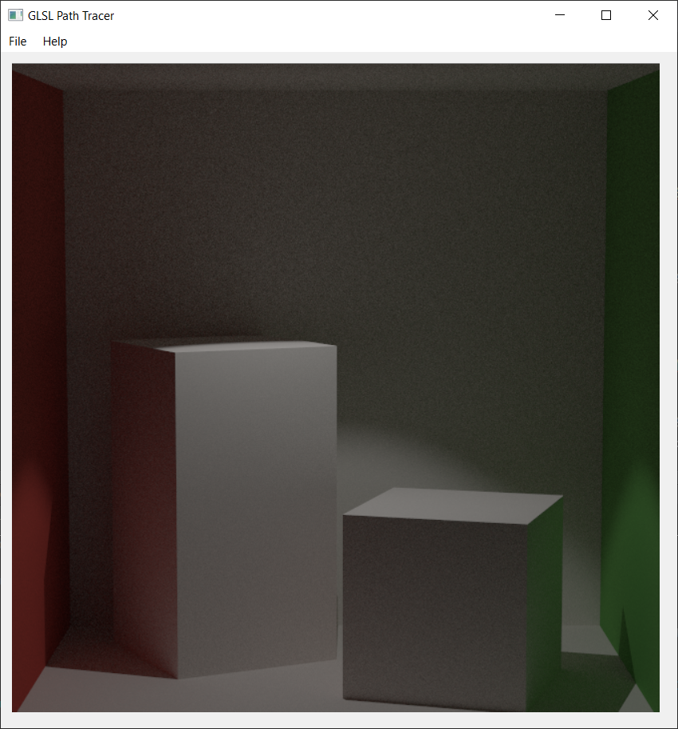

`PT_cornellBoxPointLight.json`

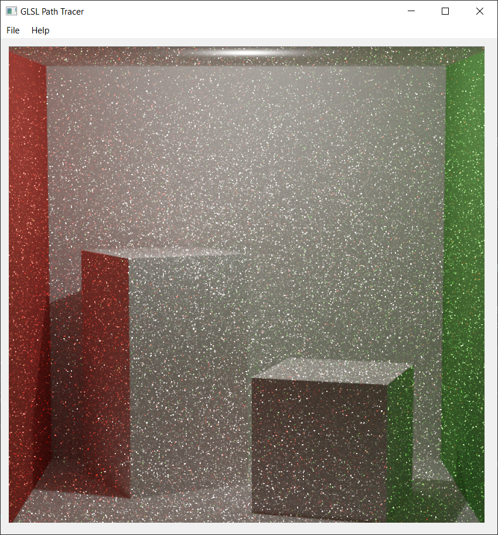

`PT_roughMirrorBoxUniform.json`

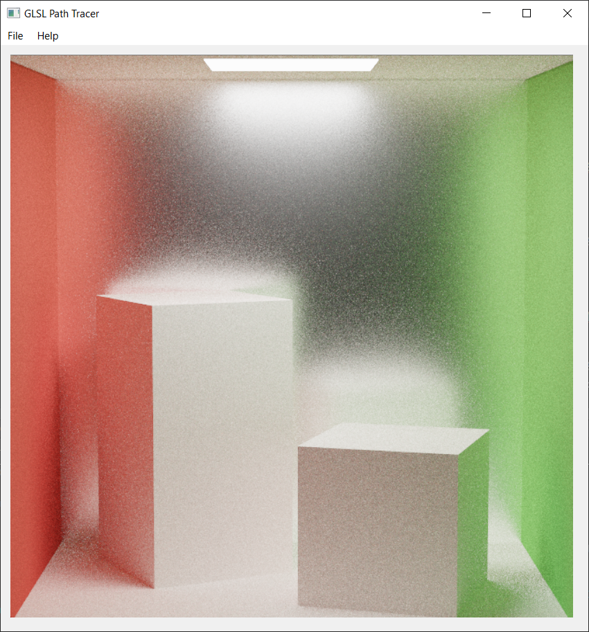

Environment lighting (10 points)
---------
In the `Sample_Li` function we provided you, there is a preprocessor
directive that currently disables sampling the scene's environment
light. Remove the directive so that your `num_lights` is equal to
`N_LIGHTS + 1`.

Then, fill out the body of the `else` statment in `Sample_Li` to allow
the environment map accessed via the `u_EnvironmentMap` `sampler2D` to
act as a light source. To do this, you should cosine-sample the hemisphere
at your intersection, then return the map's color at the UV coordinates
determined by the `sampleSphericalMap` function provided in
`pathtracer.defines.glsl`. Of course, make sure you perform a shadow test
to make sure your &#969;i can actually see the environment map.
Since the environment map is intended to fill the space where no objects exist
(allowing there to be something besides a black void), &#969;i
sees the environment map only if it hits nothing in your scene.

Additionally, make sure that whenever your `Ray` in `Li_Full` hits nothing
that you return the environment map's color instead of black so that you can
see it with your primary camera rays.

Below are some renders of various scenes with environment lighting enabled:

`PT_cornellBoxNoLights.json`

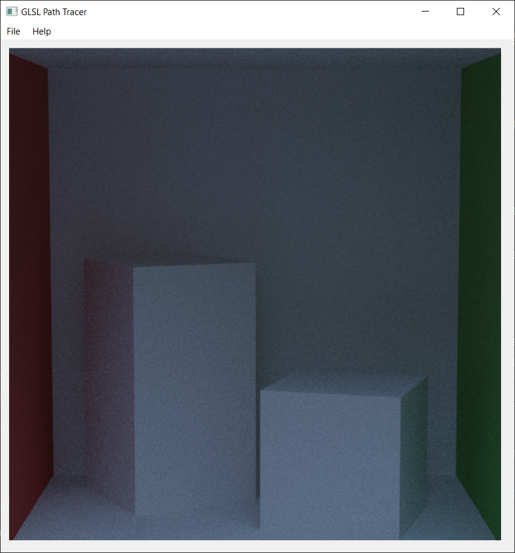

`PT_cornellBox.json`

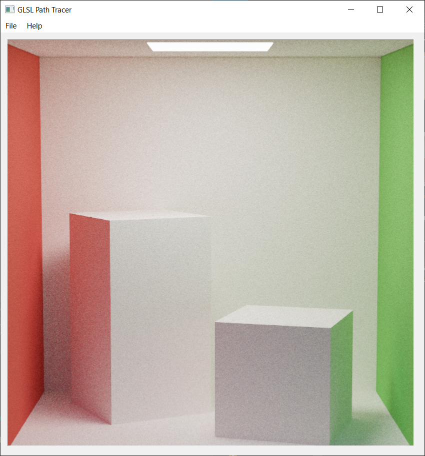

`PT_mirrorBoxDemo.json`

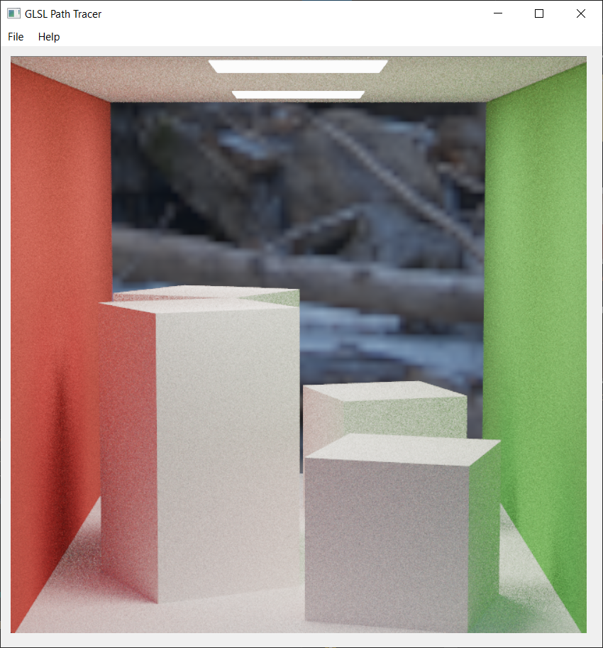

`PT_roughMirrorBoxUniform.json`

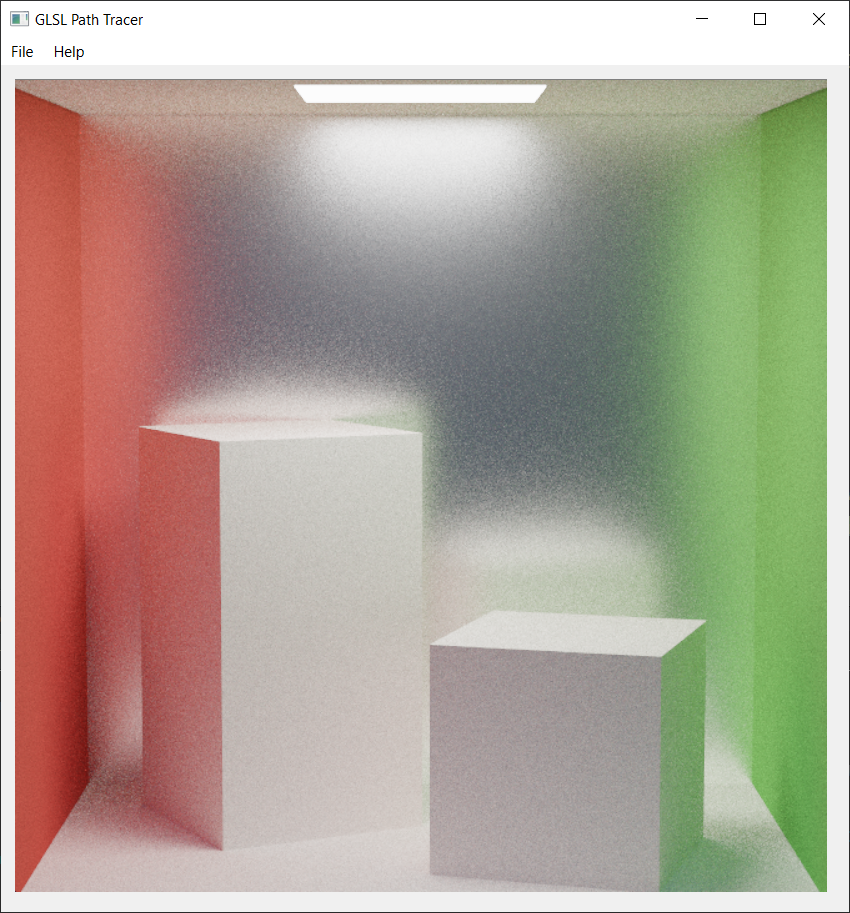

Custom scenes (30 points)
-----------
Since you are only implementing a new integrator this week, you will have time
available to design and render scenes of your own. Please create and
render __at least three__ unique scenes. They should not be variations on the
Cornell box! We want you to have unique material for your demo reel (and some
first-hand experience working with the JSON format we have made for scenes).
We expect each image to be a __minimum of 512x512 pixels__, but at least one
larger image is recommended for better demo reel quality. Make sure you take
your screenshots after letting the renderer converge for a while.

We ask that your custom scenes showcase the more visually impressive components
of your path tracer, such as a scene that includes a microfacet mirror surface
and several glass materials of various indices of refraction. Additionally,
texture maps, normal maps, and microfacet roughness maps are encouraged. You may
try to render scenes containing triangle meshes, but bear in mind that they will
take a while if your meshes have a high number of faces.

Extra credit (30 points maximum)
-----------
Choose any extra credit from a previous path tracer homework assignment and
implement it, provided of course that you did not previously do so. As always,
you are free to implement a feature not listed as extra credit if it is not a
required feature of some other assignment, e.g. a subsurface scattering BXDF.

Submitting your project
--------------
Along with your project code, make sure that you fill out this `README.md` file
with your name and PennKey, along with your test renders.

Rather than uploading a zip file to Canvas, you will simply submit a link to
the committed version of your code you wish us to grade. If you click on the
__Commits__ tab of your repository on Github, you will be brought to a list of
commits you've made. Simply click on the one you wish for us to grade, then copy
and paste the URL of the page into the Canvas submission form.
